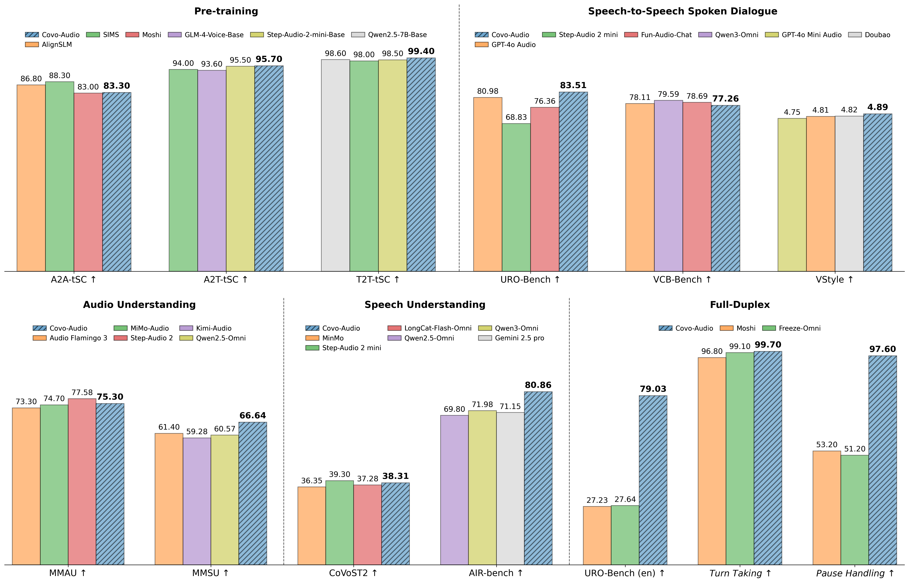

# Covo-Audio

<div align="center">

<h1>
Covo-Audio Technical Report
</h1>

[](https://arxiv.org/abs/2602.09823)
[](https://github.com/Tencent/Covo-Audio)
[](https://huggingface.co/tencent/Covo-Audio-Chat)

</div>

## 📖 Overview

Covo-Audio is a 7B-parameter end-to-end large audio language model that directly processes continuous audio inputs and generates audio outputs within a single unified architecture, which is presented in the paper [Covo-Audio Technical Report](https://arxiv.org/abs/2602.09823). We release Covo-Audio-Chat in this repository.

<div align="center">
    <figure>
        
        <br> <figcaption><em>An Overview of Comprehensive Performance Comparison.</em></figcaption>
    </figure>
</div>


### Key Features

- **Hierarchical Tri-modal Speech-Text Interleaving**:  We propose a framework designed to achieve deep alignment and fusion across modalities and scales. The Tri-modal aspect integrates continuous acoustic features, discrete speech tokens, and natural language text within a unified sequence, effectively bridging the gap between high-fidelity prosodic nuances and robust semantic structures.

- **Mitigating Intelligence-Speaker Coupling**: We propose a intelligence-speaker decoupling technique that decouples speaker from dialogue intelligence via multi-speaker training, then develop a contextual adaptation method to transfer and share high-quality TTS voice.

- **Native Full-Duplex Voice Interaction**: We evolve Covo-Audio into Covo-Audio-Chat-FD, a variant with native, low-latency full-duplex capability. 

- **Comprehensive State-of-the-Art Performance**: Achieving state-of-the-art or competitive performance among models of comparable scale across a broad spectrum of tasks, including spoken dialogue, speech understanding, audio understanding, and full-duplex voice interaction.


## 🔧 Installation
### 1. Requirements
Recommends Python >= 3.11

```bash
conda create -n covoaudio python=3.11
conda activate covoaudio
pip install -r requirements.txt
```

### 2. Clone Repository
```bash
git clone https://github.com/Tencent/Covo-Audio.git
cd Covo-Audio
```

### 3. Download Pretrained Models

**Using HuggingFace:**
```bash
pip install huggingface-hub
hf download tencent/Covo-Audio-Chat --local-dir ./covoaudio
```
By running the above script, you can use the model downloaded from huggingface to override the directory of the same name in this repository. Or you can specify your own directory to store the model by modifying the `local-dir` argument (In this case, you need to edit the arguments `model_dir` and `decode_load_path` in `example.sh` accordingly before running the inference script).


## 🚀 Usage

### Run Inference Scripts
After completeing the configuration and model downloading, you can perform one-click inference by running the script:
```bash
bash example.sh
```
To perform interaction with our model, just replace the paths in `example.py` with your own audio files.


---

## 🙏 Acknowledgments

Part of the code for this project is based on the following open-source projects:
- [**Transformers**](https://github.com/huggingface/transformers)
- [**BigVGAN**](https://github.com/NVIDIA/BigVGAN)

The llm backbone and audio encoder of Covo-Audio are initialized respectively with the weights from:
- [**Qwen2.5-7B**](https://huggingface.co/Qwen/Qwen2.5-7B)
- [**Whisper**](https://huggingface.co/openai/whisper-large-v3)

---

## 🔗 Citation
If you find this model useful, please cite our paper:

```bibtex
@misc{wang2026covoaudiotechnicalreport,
      title={Covo-Audio Technical Report}, 
      author={Wenfu Wang and Chenxing Li and Liqiang Zhang and Yiyang Zhao and Yuxiang Zou and Hanzhao Li and Mingyu Cui and Hao Zhang and Kun Wei and Le Xu and Zikang Huang and Jiajun Xu and Jiliang Hu and Xiang He and Zeyu Xie and Jiawen Kang and Youjun Chen and Meng Yu and Dong Yu and Rilin Chen and Linlin Di and Shulin Feng and Na Hu and Yang Liu and Bang Wang and Shan Yang},
      year={2026},
      eprint={2602.09823},
      archivePrefix={arXiv},
      primaryClass={cs.SD},
      url={https://arxiv.org/abs/2602.09823}, 
}
```

## 📄 License
Our model and code are licensed under [Apache 2.0](LICENSE) License.


## ✉️ Contact
If you have any questions or suggestions, feel free to contact us:

[](mailto:wenfuwang@tencent.com)
[](mailto:chenxingli@tencent.com)
[](mailto:tatelqzhang@tencent.com)
[](mailto:yyangyzhao@tencent.com)
[](mailto:yuxiangzou@tencent.com)
[](mailto:ericmycui@tencent.com)
[](mailto:draymondxu@tencent.com)

## 📔 Disclaimer
Covo-Audio-Chat is for research and experimental purposes only. It may occasionally produce inaccurate, inappropriate, biased, outdated, or factually incorrect content. Users should independently verify critical information, and are solely responsible for their use of the model and any consequences thereof. 